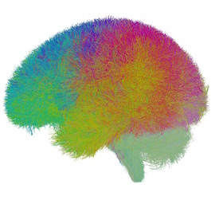

# Tutorial

This tutorial explains how to perform whole-brain tractography parcellation of a single subject using the [whitematteranalysis (WMA)](https://github.com/SlicerDMRI/whitematteranalysis) software and the anatomically curated [O'Donnell Research Group (ORG)](https://github.com/SlicerDMRI/ORG-Atlases) white matter atlas. 

On this page, we provide step-by-step instructions to guide a user to run the entire tractography parcellation pipeline. The commands used on this page outline the major steps in the wrapper script “_wm_apply_ORG_atlas_to_subject.sh_” in WMA. This wrapper script is provided to run the whole pipeline in one command, and it is useful for batch processing of data from multiple subjects (see here for a tutorial for batch processing).

## 1. Software prerequisites
   - Install [whitematteranalysis (WMA)](https://github.com/SlicerDMRI/whitematteranalysis#wma-installation)
   - Install [3D Slicer](https://download.slicer.org/)
   - Install [SlicerDMRI](http://dmri.slicer.org/download/)
    
## 2. Download the tutorial data
   - Download the tutorial data package (WMA_tutorial_data.zip, ~2.5GB)
   - Decompress the downlaoded zip file to *Desktop* of your computer
   - Files in the decompressed data folder should be organized as below, including:
      - An example tractography dataset (computed from one example Human Connectome Project (HCP) subject using the two-tensor Unscented Kalman Filter (UKF) fiber tracking method)
      - The ORG white matter atlas (see here for details)
      
      

## 3. Prepare terminal environment to run related commands
  - MacOS: Open */Applications/Utilities/Terminal.app*
  - Linux (e.g. Red Hat): Open */Applications/System Tools/Terminal*
  - Windows: Open *XX*
    
      > **_Note_**: The tutorial on this page is based on MacOS. All commands in this tutorial can be directly used on Linux. For Windows, users need to change the commands by using Windows system separator “\”.

1. Go to the tutorial data folder from terminal
    - From the terminal, type the following command. (Make sure that you have decompressed the tutorial data to your desktop, as mentioned above.)
    
        ```bash
        cd /Users/YOUR_USER_NAME/Desktop/WMA_tutorial_data
        ```
    - You terminal should look like the below image (the username should change according to your computer). Type ```ls``` to list the files in the tutorial data folder on the terminal.
    
      
    
1. Initial tractography data quality control

    This QC step is important to: 1) verify correct appearance of tract anatomy, and 2) verify tractography is stored using the same spatial coordinate system as the atlas tractography data.
   
   1. Run QC using “wm_quality_control_tractography.py”
   
      - This script outputs rendered images of the input tractography data (as well as other information such as fiber length distributions and diffusion data fields stored along the tracts). Here, this script to verify correct appearance of tract anatomy of the input tractography dataset. From your terminal, type the following command:
      
        ```bash
        wm_quality_control_tractography.py ./ ./QC-TractVisualization/
        ```
        
        > **_Note_**: This script also allows for tractography visualization and QC of multiple tractography datasets at the same time. This is useful when you perform a study (e.g. between-population analysis) where you have tractography data from multiple subjects. Please see here for details of batch processing using WMA.
        
      - A new “QC-TractVisualization” folder is generated, including several types of outputs:
        - Multiple HTML files to enable tractography visualization from different views. Click on one of them, e.g., “view_left.html”, the HTML file will be opened in your browser to show the tractography from the left view (as displayed below). Click on the “sample_UKF_HCP” image, another HTML page will be opened to show the tractography from 6 different views (as displayed below). These images show that the input tractography has a correct appearance of white matter tract anatomy.
        - “fiber_length_histograms.pdf” and “quality_control_fibers.txt” to show fiber length distributions. 
        - “quality_control_data.txt” to show the diffusion data fields stored along the tracts.
        
          

   1. Run QC using “wm_quality_control_tract_overlap.py”
     
      - This script outputs rendered images of two input tractography datasets together to show tract overlap. Here, this script is used to check if the input tractography data and the atlas tractography data are stored using the same spatial coordinate system. From your terminal, type the following command:
       
        ```bash
        wm_quality_control_tract_overlap.py ./ORG-Atlases-1.1.1/ORG-800FC-100HCP/atlas.vtp ./example-UKF-data.vtk ./QC-TractOverlap-Initial/
        ```
        
      - A new “QC-TractOverlap-Initial” folder is generated, including multiple JPG files to enable visualization of tract overlap from different views. Open one of them, e.g., “view_left_tract_overlap.jpg”, where the different colors represent the different tractography data (as displayed below). This image shows that the two tractography files are in the same coordinate system, but they are not aligned together.
       
        
        
1. Tractograpy fiber clustering
    
    This step performs fiber clustering of the registered tractography data, resulting in an 800-cluster white matter parcellation according to the ORG atlas. This step includes multiple commands: initial fiber clustering of the registered tractography, outlier removal to filter false positive fibers, and assessment of hemispheric location of each fiber in the obtained clusters.
    
    1. Run initial fiber clustering using “wm_cluster_from_atlas.py” 
    
       - This script runs fiber clustering to parcellate the registered tractography into 800 fiber clusters according to the ORG atlas. From your terminal, type the following command:
    
         ```bash
         wm_cluster_from_atlas.py ./TractRegistration/example-UKF-data/output_tractography/example-UKF-data_reg.vtk ./ORG-Atlases-1.1.1/ORG-800FC-100HCP/ ./FiberClustering/InitialClusters
         ```
         
         > **_Note_**: This script runs bilateral clustering that simultaneously segments fibers in both hemispheres to improve parcellation robustness [ref]. The resulting 800 fiber clusters include 84 commissural clusters and 716 bilateral hemispheric clusters (that include fibers in both hemispheres).
      
       - A new “FiberClustering/InitialClusters/example-UKF-data_reg” folder is generated, including the resulting 800 fiber cluster files (“cluster_00xxx.vtp”) and multiple JPG files. Open one of JPG files, e.g., “view_left.jpg”, to visualize the tractography parcellation of the 800 fiber clusters (as displayed below). This image shows the different colors represent fibers from different fiber clusters.
         
         

    1. Run QC of initial fiber clustering using “wm_quality_control_tractography.py”
    
       - This script is used here to do a visualization of each individual cluster obtained above. From your terminal, type the following command:
      
         ```bash
         wm_quality_control_tractography.py ./FiberClustering/InitialClusters/example-UKF-data_reg/ ./QC-FiberCluster-Initial
         ```
      
       - A new folder “QC-FiberCluster-Initial” is generated. Clicking on one of the HTML files, e.g. “view_left.html”, will open your browser to show all fiber clusters (as displayed below). These images show that the initial fiber clustering has been performed successfully.
      
         > **_Note_**: Clicking on one of the displayed cluster images, e.g., cluster_00004, will open another webpage to show this cluster from 6 different views (as displayed below). From the inferior view, we can see there are some outlier fibers that are improbable to other fibers in the cluster. These outlier fibers will be removed in the next step.
      
         

    1. Run outlier fiber removal using “wm_cluster_remove_outliers.py”
    
       - This script identifies and removes outlier fiber of each cluster according to the corresponding atlas fiber cluster [ref]. From your terminal, type the following command:
       
         ```bash
         wm_cluster_remove_outliers.py ./FiberClustering/InitialClusters/example-UKF-data_reg/ ./ORG-Atlases-1.1.1/ORG-800FC-100HCP/ ./FiberClustering/OutlierRemovedClusters
         ```
         
       - A new folder “./FiberClustering/OutlierRemovedClusters/example-UKF-data_reg_outlier_removed” is generated. Inside this folder, there are 800 vtp files, where outlier fibers were removed for each cluster.    
     
    1. Run QC of outlier fiber removal using “wm_quality_control_tractography.py”
    
       - This script is used here to do a visualization of each individual cluster obtained above. From your terminal, type the following command:
       
          ```bash
          wm_quality_control_tractography.py ./FiberClustering/OutlierRemovedClusters/example-UKF-data_reg_outlier_removed/ ./QC-FiberCluster-Outlier-Removed
          ```
          
        - A new folder “QC-FiberCluster-Outlier-Removed” is generated. Clicking on one of the HTML files, e.g. “view_left.html”, will open your browser to show all fiber clusters (as displayed below). Then, clicking on one of the displayed cluster images, e.g., cluster_00004, will open another webpage to show this cluster from 6 different views (as displayed below). Comparing the initial fiber clustering results (shown in 5.3) of cluster_0004, outlier fibers have been removed.
        
          

    1. Fiber hemisphere location assessment using “wm_assess_cluster_location_by_hemisphere.py”
       
       - This script assess the hemispheric location (left, right or commissural) of each fiber in each fiber cluster. Each cluster (the vtp file) is updated by adding additional information about hemisphere location, which will be used to separate the clusters after transforming them back to the input tractography space (step 6). From your terminal, type the following command:

          ```
          wm_assess_cluster_location_by_hemisphere.py ./FiberClustering/OutlierRemovedClusters/example-UKF-data_reg_outlier_removed/ -clusterLocationFile ./ORG-Atlases-1.1.1/ORG-800FC-100HCP/cluster_hemisphere_location.txt
          ```
          
          > **_Note_**: ```-clusterLocationFile``` is used to specify a file that defines the cluster hemisphere location in the ORG atlas. Each atlas cluster is assigned either hemispheric or commissural. This file guides the assessment of hemisphere location of each fiber in the computed fiber clusters.
          
        - A log file “OutlierRemovedClusters/sample_UKF_HCP_reg_outlier_removed/cluster_location_by_hemisphere.log” is generated. Opening this log file using a text editor will show a message “<wm_assess_cluster_location_by_hemisphere.py> Done!!!”.

1. Transform fiber clusters and separate into left/right/commissural

    This step transforms the obtained fiber clusters (in the ORG atlas space) back to the input tractography space, and it separates the transformed clusters into left, right and commissural tracts.

    1. Run cluster transform using “wm_harden_transform.py”
    
       - This script applies the inverse transformation matrix (a .tfm file) computed in tractography registration (step 4) to the fiber cluster files. 3D Slicer is needed to do the transform. From your terminal, type the following command:
       
         ```
         wm_harden_transform.py -i -t ./TractRegistration/example-UKF-data/output_tractography/itk_txform_example-UKF-data.tfm ./FiberClustering/OutlierRemovedClusters/example-UKF-data_reg_outlier_removed/ ./FiberClustering/TransformedClusters/example-UKF-data /Applications/Slicer.app/Contents/MacOS/Slicer
         ```
         
         > **_Note_**: In this example, we give the path to 3D Slicer under MacOS, which needs to be changed according to your computer.
         
       - A new folder “FiberClustering/TransformedClusters/example-UKF-data/” is generated. Inside the folder, there are 800 vtp files, which have been transformed in the input tractography space.
       
         > **_Note_**: If a two-step tractography registration of 'affine+nonrigid' is used (Step 4.1), a two-step transformation is needed, including a first inverse-nonrigid (using the tmf file in the nonrigid registration result folder) and then an inverse-affine (using the tmf file in the affine registration result folder) with the inverse-nonrigid output as input.
         
    1. Run hemisphere-based cluster separation using “wm_separate_clusters_by_hemisphere.py”
    
       - This script separates the fiber clusters based on the hemisphere location computed in Step 6.v. The output is three directories of fiber bundles according to left hemisphere, right hemisphere, and commissural tracts. From your terminal, type the following command:
       
         ```bash
         wm_separate_clusters_by_hemisphere.py ./FiberClustering/TransformedClusters/example-UKF-data/ ./FiberClustering/SeparatedClusters/
         ```
         
       - A new folder “FiberClustering/SeparatedClusters” is generated. Inside the folder, three are sub-folders “tracts_commissural”, “tracts_left_hemisphere”, and “tracts_right_hemisphere” (as displayed below).
       
         > **_Note_**: For each of these sub-folders, there are 800 fiber clusters. If a cluster is a hemispheric tract as given in ```-clusterLocationFile``` (Step 6.v), there will be no fibers in the vtk file in the “tracts_commissural” folder; otherwise, if a cluster is a commissural tract, there will be no fibers in vtk files in the “tracts_left_hemisphere” and  “tracts_right_hemisphere” folders.
       
         
         
1. Identification of anatomical tracts

    This step computes anatomical fiber tracts based on the obtained fiber clusters and their anatomical definitions (to which anatomical structures they belong). In the atlas, we provide anatomical tract definitions of 58 deep white matter tracts  plus 198 superficial fiber clusters. These are organized in a 3D Slicer scene file (in medical reality modeling language (MRML), an XML format).
    
    1. Run appending clusters using “wm_append_clusters_to_anatomical_tracts.py”
    
       - This script finds the clusters defined in a tract MRML file and appends the clusters into one tract. From your terminal, type the following command:
       
         ```bash
         wm_append_clusters_to_anatomical_tracts.py ./FiberClustering/SeparatedClusters/ ./ORG-Atlases-1.1.1/ORG-800FC-100HCP/ ./AnatomicalTracts
         ```
         
       - A new folder “AnatomicalTracts” is generated. Inside the folder, there are 74 vtp files, corresponding to the 74 anatomical tracts defined in the ORG atlas.
       
         > **_Note_**: These tracts contains 58 deep white matter tracts including major long range association and projection tracts, commissural tracts, and tracts related to the brainstem and cerebellar connections, plus 198 short and medium range superficial fiber clusters organized into 16 categories according to the brain lobes they connect.
         
     1. Run QC using “wm_quality_control_tractography.py”
       
        - From your terminal, type the following command:
        
          ```
          wm_quality_control_tractography.py ./AnatomicalTracts/ ./QC-AnatomicalTracts
          ```
          
        - A new folder “QC-AnatomicalTracts” is generated. Clicking on one of the HTML files, e.g. “view_left.html”, will open your browser to show all anatomical tracts (as displayed below). 
        
          
        
1. Fiber tract diffusion measurements

    This step computes diffusion measurements of the obtained fiber clusters and anatomical tracts and exports the measurements in CSV files.
    
    1. Run fiber cluster measurements using “wm_diffusion_measurements.py”
    
       - This scripts reads vtk/vtp files in a folder and outputs multiple statistics of the diffusion data fields stored along the tracts. The FiberTractMeasurements module in 3D Slicer is needed to do the transformation. From your terminal, type the following commands (for left, right and commissural clusters separately):
       
         ```bash
         wm_diffusion_measurements.py ./FiberClustering/SeparatedClusters/tracts_left_hemisphere/ ./FiberClustering/SeparatedClusters/diffusion_measurements_left_hemisphere.csv /Applications/Slicer.app/Contents/Extensions-28266/SlicerDMRI/lib/Slicer-4.11/cli-modules/FiberTractMeasurements
       
         wm_diffusion_measurements.py ./FiberClustering/SeparatedClusters/tracts_right_hemisphere/ ./FiberClustering/SeparatedClusters/diffusion_measurements_right_hemisphere.csv /Applications/Slicer.app/Contents/Extensions-28266/SlicerDMRI/lib/Slicer-4.11/cli-modules/FiberTractMeasurements
       
         wm_diffusion_measurements.py ./FiberClustering/SeparatedClusters/tracts_right_hemisphere/ ./FiberClustering/SeparatedClusters/diffusion_measurements_right_hemisphere.csv /Applications/Slicer.app/Contents/Extensions-28266/SlicerDMRI/lib/Slicer-4.11/cli-modules/FiberTractMeasurements
         ```
       
         > **_Note_**: Here, we give the path to the FiberTractMeasufrements module under MacOS, which needs to be changed based on the operating system you are using.
         
        - Three new CSV files are generated. Open one of them using Excel to see the diffusion measurements statistics (as displayed below). 
        
          > **_Note_**: For the empty vtp file (e.g. cluster_00001 is a hemispheric cluster, and it does have fibers in the commissual category), “NAN” will be assigned.
          
          
          
    1. Run anatomical tract diffusion measurements using “wm_diffusion_measurements.py”
    
       - This runs this same script as above. But, the input folder is changed to be the anatomical tracts. From your terminal, type the following command:
       
         ```bash
         wm_diffusion_measurements.py ./AnatomicalTracts/ ./AnatomicalTracts/diffusion_measurements_anatomical_tracts.csv  /Applications/Slicer.app/Contents/Extensions-28266/SlicerDMRI/lib/Slicer-4.11/cli-modules/FiberTractMeasurements
         ```
         
       - A new csv file “diffusion_measurements_anatomical_tracts.csv” is generated. Open this file using Excel to see the diffusion measurements statistics (as displayed below).
       
          
