# Tutorial

This tutorial explains how to perform whole-brain tractography parcellation using the [whitematteranalysis (WMA)](https://github.com/SlicerDMRI/whitematteranalysis) software and the anatomically curated [O'Donnell Research Group (ORG)](http://dmri.slicer.org/atlases/) white matter atlas.

On this page, we provide step-by-step instructions to guide a user to run the entire tractography parcellation pipeline for **_an individual subject_**.

   > We also provide a master shell script ```wm_apply_ORG_atlas_to_subject.sh``` (see documentation [here](https://github.com/SlicerDMRI/whitematteranalysis/blob/73a7948751f49d9fda8ec84fb5caeecaeeb92621/bin/wm_apply_ORG_atlas_to_subject.sh#L1-L40)) that enables running the whole pipeline in one command. However, we recommend the users to run through the following step-by-step tutorial first to get familiar with the whole fiber clustering pipeline.
   
   > Note: ```wm_apply_ORG_atlas_to_subject.sh``` provides options to remove intermediate files to save disk space.

## 1. Software prerequisites
   - Install [3D Slicer](https://download.slicer.org/)
      > 3D Slicer is an open source software platform for medical image informatics, image processing, and three-dimensional visualization.
   - Install [SlicerDMRI](http://dmri.slicer.org/download/)
      > SlicerDMRI is an open-source project to improve and extend diffusion magnetic resonance imaging software in 3D Slicer.
   - Install [whitematteranalysis (WMA)](https://github.com/SlicerDMRI/whitematteranalysis#wma-installation)
      > WMA is an open source software package for data-driven fiber clustering white matter parcellation.
    
## 2. Download tutorial data
   - Download the tutorial data package ([WMA_tutorial_data.zip](https://www.dropbox.com/s/beju3c0g9jqw5uj/WMA_tutorial_data.zip?dl=0), ~2.5GB)
   - Decompress the downloaded zip file to *Desktop* of your computer
   - Files in the decompressed data folder should be organized as below, including:
     - The O'Donnell Research Group (ORG) white matter atlas (“_ORG-Atlases-1.1.1_”)
        > The ORG atlas contains an 800-cluster parcellation of the entire white matter and an anatomical fiber tract parcellation (see [here](http://dmri.slicer.org/atlases) for more details).
     - An example tractography dataset (“_example-UKF-data.vtk_”)
        > This tractography data was computed from one [Human Connectome Project (HCP)](https://www.humanconnectome.org/) young adult subject using the two-tensor [Unscented Kalman Filter (UKF)](https://github.com/pnlbwh/ukftractography) fiber tracking method.
     - Related commands that will be used in this tutorial (“_etutorial_commands.txt_”)
      
        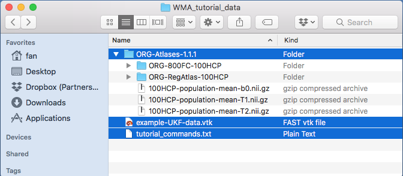

## 3. Prepare terminal environment to run related commands
   - Open terminal from the operating system that you are using
      - macOS: Open */Applications/Utilities/Terminal.app*
      - Linux (e.g. Red Hat): Open */Applications/System Tools/Terminal*
      - Windows (e.g. Windows 10): TBD
    
        > **_Note_**: This tutorial is based on macOS. All commands listed can be directly used on Linux. For Windows, users need to change the commands by using Windows system separator “\”.

   - Go to the tutorial data folder from terminal by typing the following command. (Make sure that you have decompressed the tutorial data to your desktop)
    
        ```bash
        cd /Users/YOUR_USER_NAME/Desktop/WMA_tutorial_data
        ```
      - Your terminal should look like the below image (the username should change according to your computer). Type ```ls``` to display the files in the tutorial data folder on the terminal.
    
        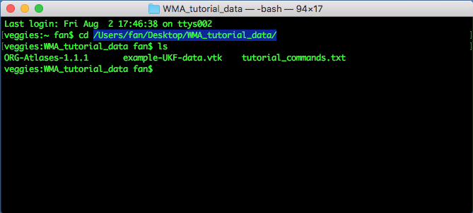

## 4. Initial tractography data quality control (QC)

This step performs QC of the input tractography data (“_example-UKF-data.vtk_”) to: 1) verify correct appearance of tract anatomy, and 2) verify tractography is stored using the same spatial coordinate system as the atlas tractography data.
   
   - Run QC to verify appearance of tract anatomy using “**_wm_quality_control_tractography.py_**”
     
     This script outputs rendered images of the input tractography (as well as other information such as fiber length distributions and diffusion data fields stored along the tracts). Here, this script to verify correct appearance of tract anatomy of the input tractography dataset. From your terminal, type the following command:
      
     ```bash
     wm_quality_control_tractography.py ./ ./QC/InputTractography/
     ```
        
        > **_Note_**: This script also allows for QC of multiple tractography datasets at the same time. This is useful in a study where you have tractography data from multiple subjects. Please see [here]() for details of batch processing using WMA.
        
      - A new “_QC/InputTractography_” folder is generated, including several types of outputs:
        - Multiple HTML files to enable tractography visualization from different views (see the below pictures). Click on one of them, e.g., “_view_left.html_”, the HTML file will be opened in your browser, and it shows the tractography from the left view. Click on the “_sample_UKF_HCP_” image, another HTML page will be opened to show the tractography from 6 different views. These images show that the input tractography has a correct appearance of the whole brain white matter tract anatomy.
        - “_fiber_length_histograms.pdf_” and “_quality_control_fibers.txt_” to show fiber length distributions.
        - “_quality_control_data.txt_” to show the diffusion data fields stored along the tracts.
        
          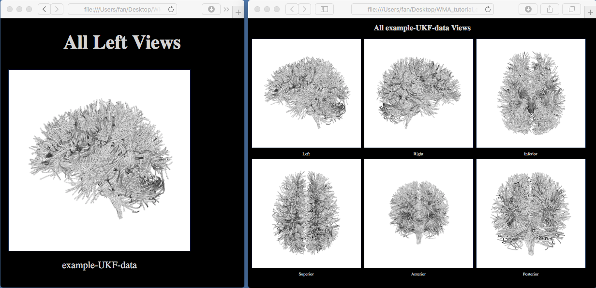

   - Run QC to verify tract spatial coordinate system using “**_wm_quality_control_tract_overlap.py_**”
     
     This script outputs rendered images of two input tractography datasets together to show tract overlap. Here, this script is used to check if the input tractography data and the atlas tractography data (“_ORG-800FC-100HCP/atlas.vtp_”) are stored using the same spatial coordinate system. From your terminal, type the following command:
       
     ```bash
     wm_quality_control_tract_overlap.py ./ORG-Atlases-1.1.1/ORG-800FC-100HCP/atlas.vtp ./example-UKF-data.vtk ./QC/InputTractOverlap/
     ```
        
      - A new “_QC/InputTractOverlap_” folder is generated, including multiple JPG files to enable visualization of tract overlap from different views. Open one of them, e.g., “_view_left_tract_overlap.jpg_”, where the different colors represent the different tractography data. The yellow tract is from the atlas, and the red tract shows the input tractography. This image shows that the two tractography files are in the same coordinate system, but they are not aligned together.
       
        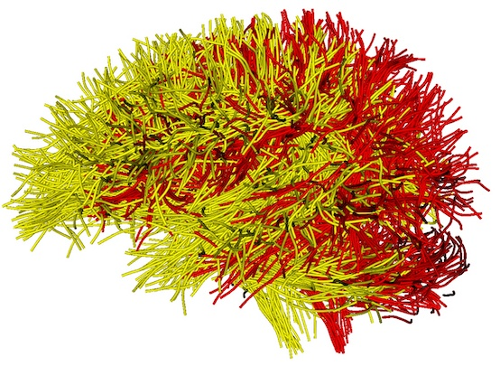
        
### 4.1. Optional: approximate brain size matching

The ORG atlas was designed to work with adult's brain data. When working with infant data, you may need to apply a
transformation to them so that the relevant data gets scaled to approximately match an adult's brain size. The purpose
of this transformation is to ensure a good fit for the registration process.

The transform file can be obtained using `Slicer`'s `Transform` module. The transformation used for scaling purposes
is a linear transform. The scaling factor (i.e. the diagonal components of the generated transformation matrix) is the
value that needs to be adjusted. Typically, a 1.5 value (across all three components) has been found to provide
reasonably good results. Once the `.tfm` file has been saved, it is used as the transform filename for the
`wm_harden_transform.py` script.

A `.tfm` file containing a linear transform will look like this:
```
#Insight Transform File V1.0
#Transform 0
Transform: AffineTransform_double_3_3
Parameters: 0.6666666666666666 0 0 0 0.6666666666666666 0 0 0 0.6666666666666666 0 0 0
FixedParameters: 0 0 0
```

Whether the chosen scaling factor is a reasonably good estimate can be assessed by applying it to a diffusion scalar
map (e.g. the FA image) in `Slicer` and seeing if it provides a brain that has the approximate same size brain as the
ORG atlas FA image.

Thus, prior to feeding the obtained tractography data to the pipeline, the transformation would be applied to the
tractography `vtk` file so that it can be scaled to approximately the size of an adult brain data.

After obtaining the tracts and the clusters, using the same script and the transform file, the inverse transformation
must be applied to scale back the tractography data to the original size.

In order to apply a transform file, the `-t` option followed by the filename containing the transformation must be
provided to the `wm_apply_ORG_atlas_to_subject.sh` script, e.g.

```shell
wm_apply_ORG_atlas_to_subject.sh -i InputTractography -o OutputDirectory -a ORGAtlasFolder -s PathTo3DSlicer -t TransformFile
```

## 5. Tractography registration

This steps registers the input tractography data to the ORG atlas tractography data.

   - Run tractography registration using “**_wm_register_to_atlas_new.py_**”
     
     This script performs a tractography-based registration to align the input example tractography data to the ORG atlas space. From your terminal, type the following command:
     
     ```bash
     wm_register_to_atlas_new.py -mode rigid_affine_fast ./example-UKF-data.vtk ./ORG-Atlases-1.1.1/ORG-RegAtlas-100HCP/registration_atlas.vtk ./TractRegistration/
     ```
        
        > **_Note_**: In this tutorial, we give an example of rigid-affine registration (```-mode rigid_affine_fast```), which in general applicable to tractography data generated from different dMRI acquisitions and different populations (such as children, young adults, and brain tumor patients). In addition to this mode, the script also enables a two-step registration of “affine + nonrigid”. This is recommended when the input tractography data that has relatively similar shape to the atlas, e.g., two-tensor UKF tractography computed from a healthy adult dataset. To do so, first run ```-mode affine``` then run ```-mode nonrigid``` afterwards with the affine output as input.

      - A new folder “_TractRegistration/example-UKF-data_” is generated. Inside this folder, you can find the registered tractography data: “output_tractography/example-UKF-data_reg.vtk” and the transform matrix: “output_tractography/itk_txform_example-UKF-data.tfm” (as displayed below).
      
         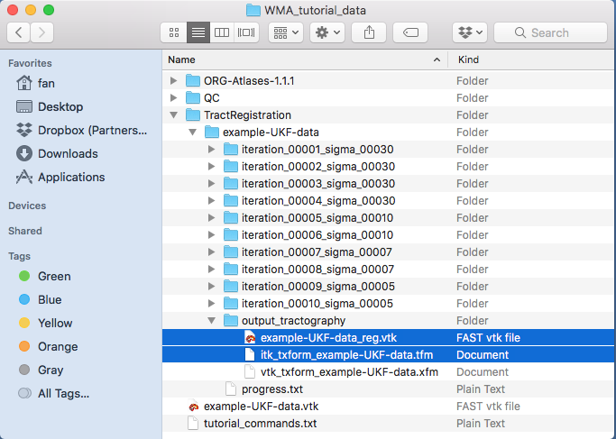

   - Run QC to check tract registration using “**_wm_quality_control_tract_overlap.py_**”

     This step is to check the registration result by visualizing tract overlap of the registered tractography and the atlas tractography. From your terminal, type the following command:
     
     ```bash
     wm_quality_control_tract_overlap.py ./ORG-Atlases-1.1.1/ORG-800FC-100HCP/atlas.vtp ./TractRegistration/example-UKF-data/output_tractography/example-UKF-data_reg.vtk ./QC/RegTractOverlap/
     ```
   
      - A new folder “_QC/RegTractOverlap_” is generated, including multiple JPG files to enable visualization of tract overlap from different views. Open one of them, e.g., “_view_left_tract_overlap.jpg_”, where the different colors represent the different tractography data (as displayed below). The yellow tract is from the atlas, and the red tract shows the input tractography. This image shows the input tractography data has been registered into the atlas space (overlapping well with the atlas tractography data; see above for the tract overlap before registration).

         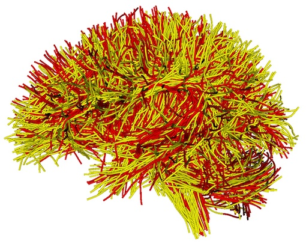

## 6. Tractography fiber clustering
    
This step performs fiber clustering of the registered tractography data, resulting in an 800-cluster white matter parcellation according to the ORG atlas. This includes the following sub-steps: 1) initial fiber clustering of the registered tractography, and 2) outlier removal to filter false positive fibers, 3) assessment of the hemispheric location (left, right or commissural) of each fiber per cluster, 4) transformation of the fiber clusters back to the input tractography space, and 5) separation of the clusters into left, right and commissural tracts.

   - Run initial fiber clustering using “**_wm_cluster_from_atlas.py_**” 
    
     This script runs fiber clustering to parcellate the registered tractography into 800 fiber clusters according to the ORG atlas. From your terminal, type the following command:
    
     ```bash
     wm_cluster_from_atlas.py ./TractRegistration/example-UKF-data/output_tractography/example-UKF-data_reg.vtk ./ORG-Atlases-1.1.1/ORG-800FC-100HCP/ ./FiberClustering/InitialClusters/
     ```
        
        > **_Note_**: This script runs bilateral clustering that simultaneously segments fibers in both hemispheres to improve parcellation robustness. The resulting 800 fiber clusters include 84 commissural clusters and 716 bilateral hemispheric clusters (that include fibers in both hemispheres).
      
      - A new “_FiberClustering/InitialClusters/example-UKF-data_reg_” folder is generated, including the resulting 800 fiber cluster files (“_cluster_00xxx.vtp_”) and multiple JPG files. Open one of JPG files, e.g., “_view_left.jpg_”, to visualize the tractography parcellation of the 800 fiber clusters (as displayed below). This image shows the different colors represent fibers from different fiber clusters.
         
         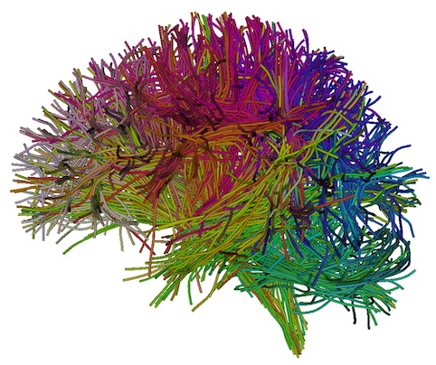

   - Run QC of initial fiber clustering using “**_wm_quality_control_tractography.py_**”
    
     This script is used here for a visualization of each individual cluster obtained above. From your terminal, type the following command:
      
     ```bash
     wm_quality_control_tractography.py ./FiberClustering/InitialClusters/example-UKF-data_reg/ ./QC/FiberCluster-Initial/
     ```
      
      - A new folder “_QC/FiberCluster-Initial_” is generated. Clicking on one of the HTML files, e.g. “_view_left.html_”, will open your browser to show all fiber clusters (as displayed below). These images show that the initial fiber clustering has been performed successfully.
      
        > **_Note_**: Clicking on one of the displayed cluster images, e.g., _cluster_00010_, will open another webpage to show this cluster from 6 different views (as displayed below). From the anterior view, we can see there are some outlier fibers that are improbable to other fibers in the cluster. These outlier fibers will be removed in the next step.
      
         

   - Run outlier fiber removal using “**_wm_cluster_remove_outliers.py_**”
    
     This script identifies and removes outlier fiber of each cluster according to the corresponding atlas fiber cluster. From your terminal, type the following command:
       
     ```bash
     wm_cluster_remove_outliers.py ./FiberClustering/InitialClusters/example-UKF-data_reg/ ./ORG-Atlases-1.1.1/ORG-800FC-100HCP/ ./FiberClustering/OutlierRemovedClusters/
     ```
         
      - A new folder “_FiberClustering/OutlierRemovedClusters/example-UKF-data_reg_outlier_removed_” is generated. Inside this folder, there are 800 vtp files, where outlier fibers have been removed in each cluster.    
     
   - Run QC of outlier fiber removal using “**_wm_quality_control_tractography.py_**”
    
     This script is used here for a visualization of each individual cluster obtained above. From your terminal, type the following command:
       
     ```bash
     wm_quality_control_tractography.py ./FiberClustering/OutlierRemovedClusters/example-UKF-data_reg_outlier_removed/ ./QC/FiberCluster-OutlierRemoved/
     ```
          
      - A new folder “_QC/FiberCluster-OutlierRemoved_” is generated. Clicking on one of the HTML files, e.g. “_view_left.html_”, will open your browser to show all fiber clusters (as displayed below). Then, clicking on one of the displayed cluster images, e.g., _cluster_00010_, will open another webpage to show this cluster from 6 different views (as displayed below). Comparing the initial fiber clustering results (see above) of cluster_0010, outlier fibers have been removed.
        
          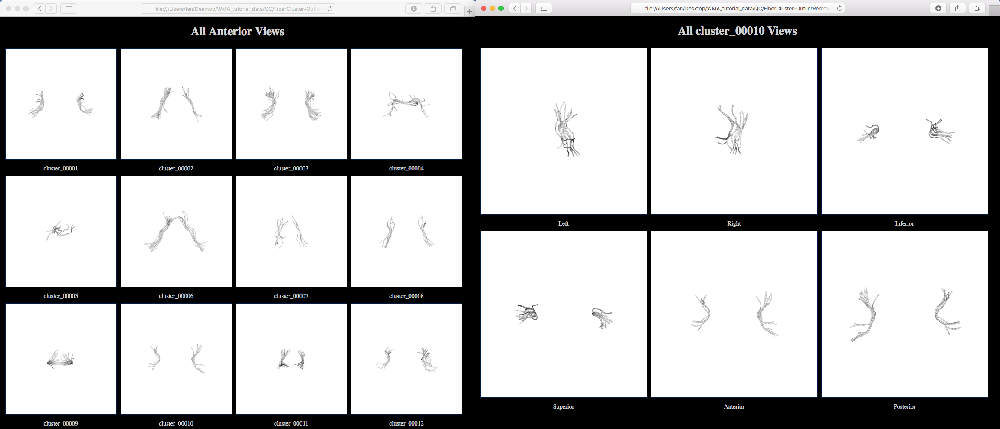

   - Assess fiber hemispheric location using “**_wm_assess_cluster_location_by_hemisphere.py_**”
       
     This script assess the hemispheric location (left, right or commissural) of each fiber in each fiber cluster. Each cluster (the vtp file) is updated by adding additional information about hemisphere location, which will be used to separate the clusters after transforming them back to the input tractography space. From your terminal, type the following command:

     ```
     wm_assess_cluster_location_by_hemisphere.py ./FiberClustering/OutlierRemovedClusters/example-UKF-data_reg_outlier_removed/ -clusterLocationFile ./ORG-Atlases-1.1.1/ORG-800FC-100HCP/cluster_hemisphere_location.txt
     ```
        > **_Note_**: ```-clusterLocationFile``` is used to specify a file that defines the cluster hemisphere location in the ORG atlas. Each atlas cluster is assigned either hemispheric or commissural. This file guides the assessment of hemisphere location of each fiber in the computed fiber clusters.
          
      - A log file “_OutlierRemovedClusters/sample_UKF_HCP_reg_outlier_removed/cluster_location_by_hemisphere.log_” is generated. Opening this log file using a text editor will show a message “**_<wm_assess_cluster_location_by_hemisphere.py> Done!!!_**”.
      
   - Transform fiber clusters using “**_wm_harden_transform.py_**”
    
     This script applies the inverse transformation matrix (a .tfm file) computed in tractography registration (step 5) to the fiber cluster files. 3D Slicer is needed to do the transform. From your terminal, type the following command:
       
     ```
     wm_harden_transform.py -i -t ./TractRegistration/example-UKF-data/output_tractography/itk_txform_example-UKF-data.tfm ./FiberClustering/OutlierRemovedClusters/example-UKF-data_reg_outlier_removed/ ./FiberClustering/TransformedClusters/example-UKF-data/ /Applications/Slicer.app/Contents/MacOS/Slicer
     ```
        > **_Note_**: In this example, we give the path to 3D Slicer under a macOS machine. This path needs to be changed according to your computer.
         
      - A new folder “_FiberClustering/TransformedClusters/example-UKF-data_” is generated. Inside the folder, there are 800 vtp files, which have been transformed in the input tractography space.
       
        > **_Note_**: If a two-step tractography registration of ```-mode affine+nonrigid``` is used (Step 4), a two-step transformation is needed, including a first inverse-nonrigid (using the tmf file in the nonrigid registration result folder) and then an inverse-affine (using the tmf file in the affine registration result folder) with the inverse-nonrigid output as input.
         
   - Run hemisphere-based cluster separation using “**_wm_separate_clusters_by_hemisphere.py_**”
    
     This script separates the fiber clusters based on the hemisphere location assessment result. The output includes three directories of fiber clusters according to left hemisphere, right hemisphere, and commissural tracts. From your terminal, type the following command:
       
     ```bash
     wm_separate_clusters_by_hemisphere.py ./FiberClustering/TransformedClusters/example-UKF-data/ ./FiberClustering/SeparatedClusters/
     ```
         
      - A new folder “_FiberClustering/SeparatedClusters_” is generated. Inside the folder, three are sub-folders “_tracts_commissural_”, “_tracts_left_hemisphere_”, and “_tracts_right_hemisphere_” (as displayed below).
       
        > **_Note_**: For each of these sub-folders, there are 800 fiber clusters. If a cluster is a hemispheric tract as given in ```-clusterLocationFile```, there will be no fibers in the vtk file in the “_tracts_commissural_” folder; otherwise, if a cluster is a commissural tract, there will be no fibers in vtk files in the “_tracts_left_hemisphere_” or  “_tracts_right_hemisphere_” folders.
       
         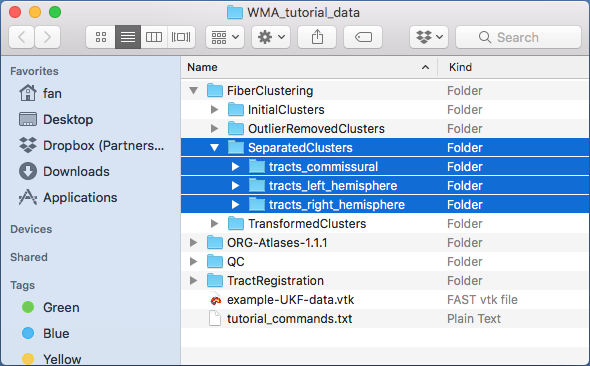
         
## 7. Identification of anatomical tracts

This step computes anatomical fiber tracts based on the obtained fiber clusters and their anatomical definitions (to which anatomical structures they belong). In the atlas, we provide anatomical tract definitions of 58 deep white matter tracts  plus 198 superficial fiber clusters. These are organized in a 3D Slicer scene file (in medical reality modeling language (MRML), an XML format).
    
   - Run appending clusters using “**_wm_append_clusters_to_anatomical_tracts.py_**”
    
     This script finds the clusters defined in a tract MRML file and appends the clusters into one tract. From your terminal, type the following command:
       
     ```bash
     wm_append_clusters_to_anatomical_tracts.py ./FiberClustering/SeparatedClusters/ ./ORG-Atlases-1.1.1/ORG-800FC-100HCP/ ./AnatomicalTracts/
     ```
         
      - A new folder “_AnatomicalTracts_” is generated. Inside the folder, there are 73 vtp files, corresponding to the 73 anatomical tracts defined in the ORG atlas.
       
        > **_Note_**: These tracts contains major long range association and projection tracts, commissural tracts, and tracts related to the brainstem and cerebellar connections, plus short and medium range superficial fiber clusters organized according to the brain lobes they connect.
         
   - Run QC of anatomical tracts using “**_wm_quality_control_tractography.py_**”
       
     From your terminal, type the following command:
        
     ```
     wm_quality_control_tractography.py ./AnatomicalTracts/ ./QC/AnatomicalTracts/
     ```
          
      - A new folder “_QC-AnatomicalTracts_” is generated. Clicking on one of the HTML files, e.g. “_view_left.html_”, will open your browser to show all anatomical tracts (as displayed below). 
        
          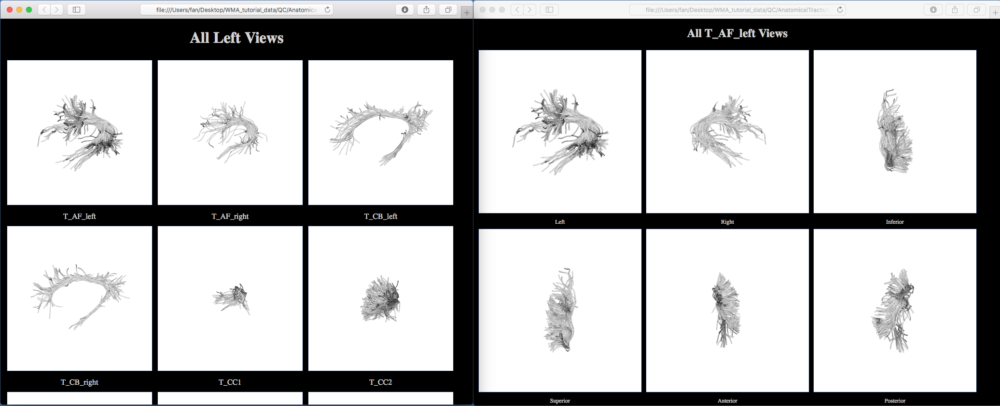
        
## 8. Fiber tract diffusion measurements

This step computes diffusion measurements of the fiber clusters and the anatomical tracts and exports the measurements in CSV files.
    
   - Run fiber cluster diffusion measurements using “**_wm_diffusion_measurements.py_**”
    
     This scripts reads vtk/vtp files in a folder and outputs multiple statistics of the diffusion data fields stored along the tracts. The FiberTractMeasurements module in 3D Slicer is needed to do the transformation. From your terminal, type the following commands (for left, right and commissural clusters separately):
       
     ```bash
     wm_diffusion_measurements.py ./FiberClustering/SeparatedClusters/tracts_left_hemisphere/ ./DiffusionMeasurements/left_hemisphere_clusters.csv /Applications/Slicer4p10realease.app/Contents/Extensions-27501/SlicerDMRI/lib/Slicer-4.10/cli-modules/FiberTractMeasurements

     wm_diffusion_measurements.py ./FiberClustering/SeparatedClusters/tracts_right_hemisphere/ ./DiffusionMeasurements/right_hemisphere_clusters.csv /Applications/Slicer4p10realease.app/Contents/Extensions-27501/SlicerDMRI/lib/Slicer-4.10/cli-modules/FiberTractMeasurements

     wm_diffusion_measurements.py ./FiberClustering/SeparatedClusters/tracts_commissural/ ./DiffusionMeasurements/commissural_clusters.csv /Applications/Slicer4p10realease.app/Contents/Extensions-27501/SlicerDMRI/lib/Slicer-4.10/cli-modules/FiberTractMeasurements
     ```
       
        > **_Note_**: Here, we give the path to the FiberTractMeasurements module under macOS. The path needs to be changed based on the operating system you are using.
        > If using a Linux OS, the script should be called as e.g.

        ```bash
        wm_diffusion_measurements.py ./FiberClustering/SeparatedClusters/tracts_left_hemisphere/ ./DiffusionMeasurements/left_hemisphere_clusters.csv "/path/to/slicer/binary --launch /path/to/slicer/cli-modules/FiberTractMeasurements"
        ```

        where `/path/to/slicer/binary` can be e.g. `/opt/Slicer-5.2.2-linux-amd64/Slicer`, and where
        `/path/to/slicer/cli-modules/FiberTractMeasurements` can be e.g.
        `/opt/Slicer-5.2.2-linux-amd64/NA-MIC/Extensions-31382/SlicerDMRI/lib/Slicer-5.2/cli-modules/FiberTractMeasurements`
        if using `Slicer 5.2.2` and having it installed in `/opt/`.

      - A new folder “_DiffusionMeasurements_” is generated, containing three CSV files. Open one of them using Excel to see the diffusion measurements statistics. 
        
        > **_Note_**: For the empty vtp file (e.g. cluster_00001 is a hemispheric cluster, and it does have fibers in the commissural category), “NAN” will be assigned.
          
          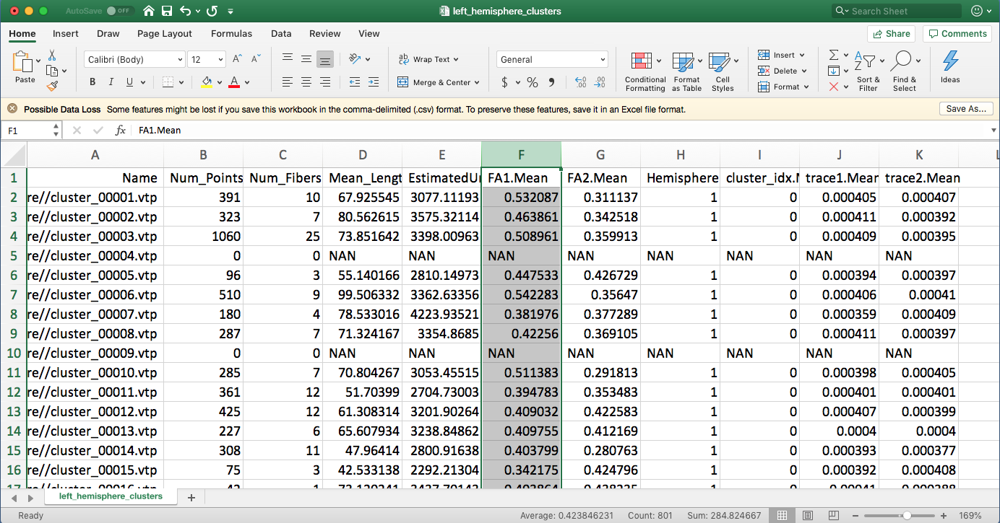
          
   - Run anatomical tract diffusion measurements using “**_wm_diffusion_measurements.py_**”
    
     This runs this same script as above. But, the input folder is changed to be the anatomical tracts. From your terminal, type the following command:
       
     ```bash
     wm_diffusion_measurements.py ./AnatomicalTracts/ ./DiffusionMeasurements/anatomical_tracts.csv  /Applications/Slicer4p10realease.app/Contents/Extensions-27501/SlicerDMRI/lib/Slicer-4.10/cli-modules/FiberTractMeasurements
     ```
         
      - A new csv file “_diffusion_measurements_anatomical_tracts.csv_” is generated. Open this file using Excel to see the diffusion measurements statistics.
       
          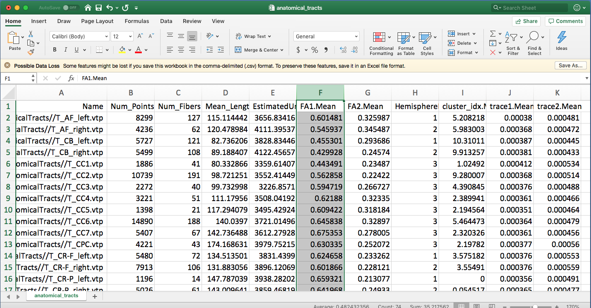
